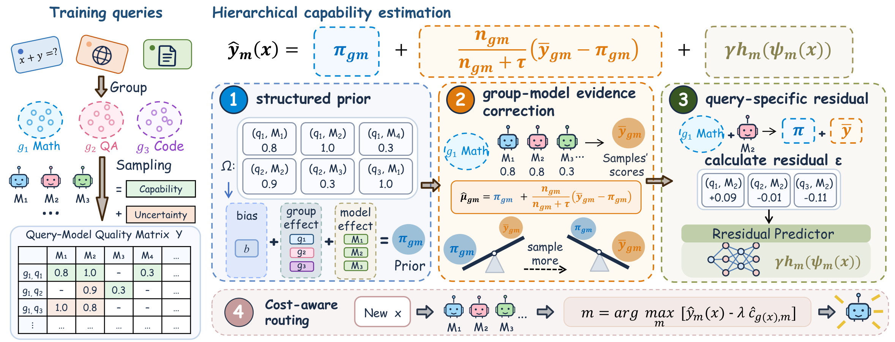
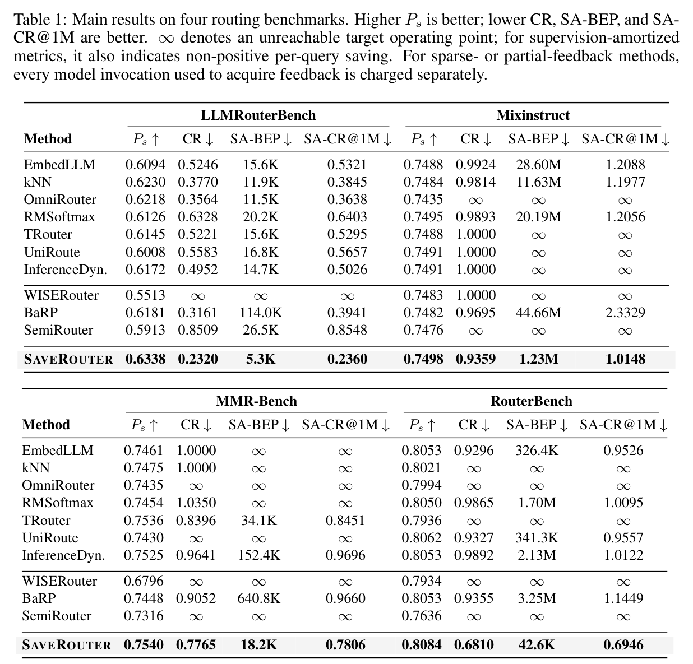

<div align="center">

<a href="https://sinapis.ai/">
  
</a>

**A research collaboration between [SinapisAI](https://sinapis.ai/) and LAMDA.**

# SAVERouter

### Routing Should Pay for Itself: Sparse Supervision for Economical LLM Routing

[](https://arxiv.org/abs/2609.37402)
[](https://github.com/LAMDA-Model-Reuse/SaveRouter/actions/workflows/ci.yml)
[](https://github.com/LAMDA-Model-Reuse/SaveRouter/releases)
[](https://pypi.org/project/saverouter/)
[](https://lamda-model-reuse.github.io/SaveRouter/)
[](https://colab.research.google.com/github/LAMDA-Model-Reuse/SaveRouter/blob/main/examples/saverouter_colab.ipynb)
[](https://www.python.org/)
[](LICENSE)

**Guannan Lai · Gelin Bian · Hao-Xuan Ma · Jun-Peng Jiang · Long Chen · Jian-Dong Liu · Zhi-Hao Tan · Han-Jia Ye**

Nanjing University · The Hong Kong University of Science and Technology · [**SinapisAI**](https://sinapis.ai/)

[[Paper](https://arxiv.org/abs/2609.37402)]
[[Code](https://github.com/LAMDA-Model-Reuse/SaveRouter)]
[[PyPI](https://pypi.org/project/saverouter/)]
[[Project Page](https://lamda-model-reuse.github.io/SaveRouter/)]
[[Colab](https://colab.research.google.com/github/LAMDA-Model-Reuse/SaveRouter/blob/main/examples/saverouter_colab.ipynb)]
[[SinapisAI](https://sinapis.ai/)]

</div>

## Overview

LLM routing can reduce serving cost, but training a router often requires
executing many candidate models on historical queries first. SAVERouter treats
this supervision expenditure as part of the routing problem. It adaptively
acquires a small, informative subset of query-model feedback, shares capability
information across related queries, and retains query-level corrections for
fine-grained routing.

Across four routing benchmarks, SAVERouter uses roughly **33–41%** of the
available training feedback while preserving competitive routing quality. The
paper introduces two metrics that account for both the upfront investment and
the subsequent serving-time savings:

- **SA-BEP:** the number of deployment queries required to recover supervision
  expenditure.
- **SA-CR:** the serving-cost ratio after amortizing supervision expenditure
  over a fixed deployment horizon.

## Method

<p align="center">
  
</p>

<p align="center"><em>Overview of SAVERouter.</em></p>

SAVERouter has three main stages:

1. **Adaptive acquisition** selects exactly `K` candidate models per training
   query using grouped empirical-Bayes UCB.
2. **Hierarchical capability estimation** combines a structured group-model
   prior with shrinkage toward the feedback collected for each group and model.
3. **Query-level refinement** learns contextual residuals and constructs the
   quality-cost routing frontier.

The sparse supervision artifact contains only acquired `(query, model,
quality, cost)` tuples. Router fitting never receives a dense outcome matrix.

## Installation

Install the core package and run the download-free smoke test:

```bash
python -m pip install saverouter
saverouter smoke-test
```

For paper reproduction, clone the repository and create the complete benchmark
environment:

```bash
git clone https://github.com/LAMDA-Model-Reuse/SaveRouter.git
cd SaveRouter
bash scripts/setup.sh
```

Run the unit tests:

```bash
.venv/bin/python -m pytest
```

## Reproducing the experiments

Run one benchmark or the complete four-benchmark suite:

```bash
bash scripts/reproduce.sh llmrouterbench
bash scripts/reproduce.sh all
```

The reproduction script downloads the original benchmark data and frozen
encoders, uses the paper profiles under `configs/paper/`, and writes results to
`outputs/`. A fresh full run requires approximately 12–15 GB of free disk
space. CUDA is recommended for MMR-Bench and first-time feature extraction;
CPU execution is supported.

After installation, the equivalent CLI command is:

```bash
saverouter reproduce --benchmark all --device auto --verify
```

The paper's main comparison is shown below. Small numerical differences can
occur across BLAS, CUDA, and encoder environments; `--verify` checks all
metrics under the repository's declared tolerances.

<p align="center">
  
</p>

<p align="center"><em>Main results on four routing benchmarks.</em></p>

The evaluator constructs the complete policy family used in the paper: 201
cost-weight policies, cost-threshold policies, and incremental
predicted-quality-gain per predicted-cost gates.

### Outputs

```text
outputs/<benchmark>/result.json       # profile, metrics, and metadata
outputs/<benchmark>/pareto.csv        # physical routing frontier
outputs/<benchmark>/supervision.npz   # exact sparse observations
outputs/main_results.csv              # four-benchmark summary
```

Dataset revisions, model order, query order, split, seed, grouping profile,
and acquisition mask are recorded for reproducibility. Dataset and encoder
artifacts are downloaded from their publishers at pinned revisions.

## Using SAVERouter on a custom benchmark

```python
from saverouter import FixedKSparseRouter, simulate_fixed_k_supervision

feedback = simulate_fixed_k_supervision(
    rewards_train,
    group_ids,
    costs=costs_train,
    k=4,
    seed=42,
)

router = FixedKSparseRouter().fit(query_features, feedback)
choices = router.route(
    test_features,
    max_cost=0.01,
    group_ids=test_group_ids,
)
```

For live feedback acquisition, use `collect_fixed_k_supervision` with a callback
that invokes a model only after it is selected. See
[`examples/online_feedback.py`](examples/online_feedback.py).

## Supervision-amortized metrics

Let `C0` be upfront supervision expenditure, `Cb` the serving cost of the best
single model, `Cr` routed serving cost at the quality target, and `Co` online
routing overhead:

```text
SA-BEP = ceil(C0 / (Cb - Cr - Co))
SA-CR@H = (C0 + H * (Cr + Co)) / (H * Cb)
```

`SA-CR@H < 1` indicates that routing has paid back its upfront supervision cost
by deployment horizon `H`. The experiments use `H = 1,000,000`.

## Repository structure

```text
configs/paper/       frozen benchmark profiles
examples/            custom and online-feedback examples
results/reference/   numerical reproduction references
saverouter/           method, benchmark adapters, and CLI
scripts/              setup and reproduction entry points
site/                 static project page and payback explorer
tests/                unit and leakage-regression tests
```

## Citation

If you find SAVERouter useful, please cite:

```bibtex
@article{lai2026routing,
  title   = {Routing Should Pay for Itself: Sparse Supervision for Economical LLM Routing},
  author  = {Lai, Guannan and Bian, Gelin and Ma, Hao-Xuan and Jiang, Jun-Peng and Chen, Long and Liu, Jian-Dong and Tan, Zhi-Hao and Ye, Han-Jia},
  journal = {arXiv preprint arXiv:2609.37402},
  year    = {2026},
  url     = {https://arxiv.org/abs/2609.37402}
}
```

## Acknowledgments

This repository adapts benchmark loaders and evaluation conventions from
[ORBIT](https://github.com/LAMDA-Model-Reuse/ORBIT). Benchmark datasets and
pretrained encoders retain their respective licenses and terms.

## License

SAVERouter is released under the [MIT License](LICENSE).
